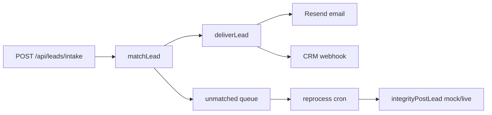
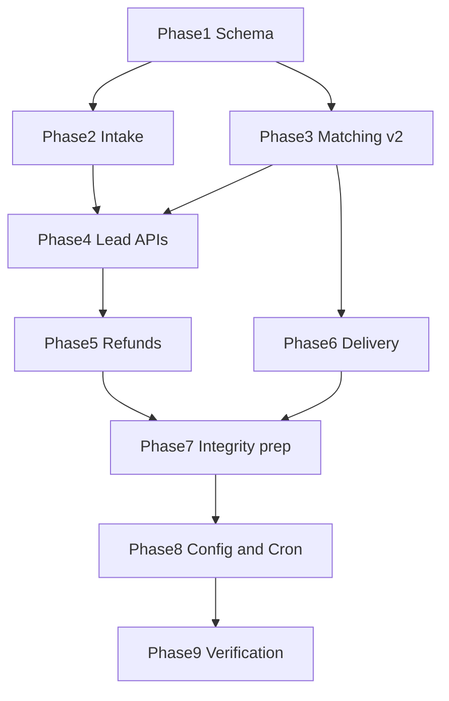

# Core Backend Completion Plan

## Scope

**In scope:** All backend gaps identified in prior analysis, aligned with [docs/BOBERDOO_GAP_ANALYSIS.md](docs/BOBERDOO_GAP_ANALYSIS.md) and the July 6 call follow-up in [docs/update_call_6-7](docs/update_call_6-7).

**Explicitly out of scope (per your direction):**

- Balance-threshold auto-charge (keep weekly Stripe subscription as-is)
- Promoting a partner to admin (keep separate Clerk accounts + `ADMIN_EMAILS` allowlist)
- IntegrityCONNECT live wiring until you provide real API specs/credentials

---

## Current baseline

Core happy path already works:

Key existing files:

- Intake: [src/lib/intake/process-intake.ts](src/lib/intake/process-intake.ts), [src/lib/intake/normalize-lead.ts](src/lib/intake/normalize-lead.ts)
- Matching: [src/lib/matching/engine.ts](src/lib/matching/engine.ts), [src/lib/matching/eligibility.ts](src/lib/matching/eligibility.ts)
- Jobs: [src/lib/jobs/reprocess-unmatched.ts](src/lib/jobs/reprocess-unmatched.ts)
- Refunds: [src/lib/refunds/process-refund.ts](src/lib/refunds/process-refund.ts)
- Settings: [src/lib/settings/app-settings.ts](src/lib/settings/app-settings.ts) (only 4 keys today)
- Aged cutoff: hardcoded `AGED_DAYS = 30` in [src/lib/aged/eligibility.ts](src/lib/aged/eligibility.ts)

Uncommitted work to land first: Boberdoo field parity migration + intake/delivery payload expansion ([prisma/migrations/20250706190000_lead_boberdoo_fields](prisma/migrations/20250706190000_lead_boberdoo_fields), [src/lib/delivery/lead-payload.ts](src/lib/delivery/lead-payload.ts)).

---

## Phase 1 — Schema foundation

### 1.1 Finish and migrate Boberdoo lead fields

- Commit/apply existing lead column expansion
- Ensure [public/feeding-platform/app.js](public/feeding-platform/app.js) and [src/app/dev/lead-simulator/simulator-form.tsx](src/app/dev/lead-simulator/simulator-form.tsx) send the full payload
- Update [src/app/api/admin/migration/import/route.ts](src/app/api/admin/migration/import/route.ts) to map all export columns

### 1.2 Add `LeadEvent` audit log

New table `lead_events` (or `lead_event_log`):

- `leadId`, `type` (received, matched, delivered, refunded, integrity_posted, aged_purchased, reprocessed, duplicate_rejected, trustedform_failed, etc.)
- `payload` JSON, `actorId` optional, `createdAt`

Emit events from:

- [src/lib/intake/process-intake.ts](src/lib/intake/process-intake.ts)
- [src/lib/matching/engine.ts](src/lib/matching/engine.ts)
- [src/lib/delivery/deliver-lead.ts](src/lib/delivery/deliver-lead.ts)
- [src/lib/refunds/process-refund.ts](src/lib/refunds/process-refund.ts)
- [src/lib/integrity/post.ts](src/lib/integrity/post.ts)
- [src/lib/aged/purchase-aged-leads.ts](src/lib/aged/purchase-aged-leads.ts)

### 1.3 Add `PartnerFilterSet` model (full Boberdoo parity)

New table replacing the flat matching fields on `Partner`:

| Field                                             | Purpose                          |
| ------------------------------------------------- | -------------------------------- |
| `partnerId`, `name`, `leadType`, `filterStates[]` | Matching criteria                |
| `priority`, `priceOverride`                       | Routing + pricing                |
| `active`                                          | Enable/disable set               |
| `hourlyLimit`, `dailyLimit`                       | Lead caps (nullable = unlimited) |
| `deliveryChannel`                                 | email / webhook / ringy          |

Migration strategy:

- Create `partner_filter_sets` table
- Backfill one active filter set per existing partner from current `filterStates`, `leadType`, `priority`, `priceOverride`
- Keep `Partner.leadType` + `filterStates` temporarily for backward compat, then stop writing to them once matching reads filter sets only

### 1.4 Partner delivery credentials

Extend `Partner` (or a `partner_delivery_credentials` JSON column):

- `crmWebhookUrl` (exists)
- `ringySid`, `ringyAuthToken` (encrypted at rest or env-backed; store per partner)
- `crmProvider` enum: `webhook | ringy | email_only`

### 1.5 Expand `app_settings` keys

Add to [src/lib/settings/app-settings.ts](src/lib/settings/app-settings.ts):

- `aged_days_threshold` (default 30, admin-configurable per call discussion)
- `trustedform_validation_enabled` (bool)
- `duplicate_check_enabled` (bool)
- `lead_type_configs` (JSON: default prices, retention per type)
- `source_vendor_configs` (JSON: LeadConduit source labels, matching flags)
- `resale_vendor_configs` (JSON: Integrity URLs, enabled flag — ready for your live API)

---

## Phase 2 — Intake hardening

### 2.1 Duplicate detection

In [src/lib/intake/process-intake.ts](src/lib/intake/process-intake.ts):

- Check `externalId` (Boberdoo `Unique_Identifier`) for exact duplicate
- Secondary check: same `email` + `phone` within configurable window (e.g. 30 days)
- On duplicate: reject with LeadConduit-compatible response, log `duplicate_rejected` event, do not create second lead

### 2.2 TrustedForm validation

New `src/lib/intake/validate-trustedform.ts`:

- If `trustedform_validation_enabled` and cert URL present: HTTP HEAD/GET to cert URL (or TrustedForm API if documented in [docs/BOBERDOO_EXPLORATION.md](docs/BOBERDOO_EXPLORATION.md))
- Store result on lead (`trustedformValid` boolean + `trustedformCheckedAt`)
- If invalid and strict mode: reject intake or flag lead as `review` status (add enum value `review` to `LeadStatus`)

### 2.3 Intake idempotency

- Support safe retries from LeadConduit using `Unique_Identifier` — return success for already-processed external IDs

---

## Phase 3 — Matching engine v2 (filter sets + limits)

Refactor [src/lib/matching/eligibility.ts](src/lib/matching/eligibility.ts) and [src/lib/matching/engine.ts](src/lib/matching/engine.ts):

1. Query **active** `PartnerFilterSet` rows where `filterStates` contains lead state and `leadType` matches
2. Enforce **hourly/daily limits** by counting `lead_deliveries` per filter set in rolling windows
3. Sort: `priority DESC`, partner `createdAt ASC` (FIFO), filter set `createdAt ASC`
4. Debit using filter set `priceOverride` or global default from settings
5. Record `filterSetId` on `LeadDelivery` (new nullable FK)

New admin API:

- `GET /api/admin/filter-list` — global view (partner, filter set, price, balance, status, limits usage)
- `CRUD /api/admin/partners/[id]/filter-sets`

Update partner onboarding to create initial filter set instead of writing flat partner fields.

---

## Phase 4 — Lead lifecycle APIs

### 4.1 Admin lead search

`GET /api/admin/leads/search?q=` — match by UUID, `externalId`, email, phone (normalized digits)

### 4.2 Admin lead actions

- `PATCH /api/admin/leads/[id]` — edit contact fields (admin edit lead)
- `POST /api/admin/leads/[id]/refund` — admin-initiated refund (creates + auto-approves or queues based on type)
- `POST /api/admin/leads/[id]/redeliver` — extend existing [src/app/api/admin/leads/[id]/reprocess/route.ts](src/app/api/admin/leads/[id]/reprocess/route.ts) to support forced redelivery to specific partner/filter set
- `DELETE /api/admin/leads/[id]` — soft-delete or mark `dead` (Boberdoo delete equivalent)

### 4.3 Lead export

`GET /api/admin/leads/export` — CSV export with field picker (core fields first; full field list from [src/lib/delivery/lead-payload.ts](src/lib/delivery/lead-payload.ts))

### 4.4 Lead timeline API

`GET /api/admin/leads/[id]/events` — returns `LeadEvent` log (Boberdoo "Show Lead Log")

---

## Phase 5 — Refunds completion

Extend [src/lib/refunds/process-refund.ts](src/lib/refunds/process-refund.ts):

- **Bulk refund:** `POST /api/admin/refunds/bulk` — approve multiple pending requests in one transaction
- **Admin-initiated:** `POST /api/admin/leads/[id]/refund` with `refundType` + optional skip partner request
- **Partner bulk request:** `POST /api/refunds/bulk` — multiple `leadDeliveryId`s

Ensure post-refund routing matches Boberdoo:

- Type A (`wrong_filter`): rematch excluding original partner, set `refundable=false` after resale
- Type B (`invalid_phone`): mark lead `dead`, no redistribution

---

## Phase 6 — Delivery integrations

### 6.1 Ringy driver

New `src/lib/delivery/ringy.ts`:

- POST JSON to Ringy API using partner `ringySid` + `ringyAuthToken` (mapping from [docs/BOBERDOO_EXPLORATION.md](docs/BOBERDOO_EXPLORATION.md) §38)
- Wire into [src/lib/delivery/deliver-lead.ts](src/lib/delivery/deliver-lead.ts) based on `crmProvider`

### 6.2 Delivery result tracking

- Log delivery attempts (email sent, CRM status code, Ringy response) as `LeadEvent`s
- Store last delivery error on `LeadDelivery` or event payload for admin troubleshooting

---

## Phase 7 — IntegrityCONNECT (prepare for live)

Keep mock mode; harden for your future API hookup:

- Move ping/post payload builders to `src/lib/integrity/build-payload.ts` using full lead fields from [src/lib/delivery/lead-payload.ts](src/lib/delivery/lead-payload.ts)
- Add `storefront` mode path in [src/lib/integrity/post.ts](src/lib/integrity/post.ts) (schema already has `ResaleMode.storefront`)
- Document required env vars in [docs/BACKEND.md](docs/BACKEND.md): `INTEGRITY_PING_URL`, `INTEGRITY_POST_URL`, `integrations_mode=live`
- **Blocked on you:** plug in real URLs/payload shape once you have Integrity docs from Sami

---

## Phase 8 — Config + cron + aged settings

### 8.1 Admin settings API expansion

Extend [src/app/api/admin/settings/route.ts](src/app/api/admin/settings/route.ts) for all new `app_settings` keys.

### 8.2 Configurable aged threshold

Replace hardcoded `AGED_DAYS = 30` in [src/lib/aged/eligibility.ts](src/lib/aged/eligibility.ts) with `getAgedDaysThreshold()` from settings.

### 8.3 Cron production readiness

- Verify [src/app/api/cron/reprocess-unmatched/route.ts](src/app/api/cron/reprocess-unmatched/route.ts) and [src/app/api/cron/integrity-post/route.ts](src/app/api/cron/integrity-post/route.ts)
- Add `scripts/verify-cron.mjs` smoke test
- Document scheduler setup in [docs/BACKEND.md](docs/BACKEND.md) (Vercel Cron / external cron + `CRON_SECRET`)

### 8.4 Stripe test verification

- Run end-to-end with test keys: checkout → webhook → ledger → lead debit
- Document `.env` checklist (no prod keys until test pass)

---

## Phase 9 — Verification

Add/update `scripts/verify-backend.mjs` scenarios:

1. Intake with full Boberdoo payload → match → delivery events logged
2. Duplicate rejection
3. Filter set with daily limit hit → partner skipped
4. Aged purchase with backdated `receivedAt`
5. Refund Type A rematch + Type B dead
6. Admin search by phone/email
7. Integrity mock post after 24h (cron simulation)
8. Migration import row with extended fields

---

## Implementation order (recommended)

**Why this order:** Filter sets touch matching, pricing, delivery, and admin APIs — migrate schema first, then intake safety, then matching, then everything else builds on events + filter sets.

---

## Files most touched

| Area       | Primary files                                                                                               |
| ---------- | ----------------------------------------------------------------------------------------------------------- |
| Schema     | [prisma/schema.prisma](prisma/schema.prisma), new migrations                                                |
| Intake     | [src/lib/intake/*](src/lib/intake/), [src/app/api/leads/intake/route.ts](src/app/api/leads/intake/route.ts) |
| Matching   | [src/lib/matching/*](src/lib/matching/)                                                                     |
| Delivery   | [src/lib/delivery/*](src/lib/delivery/)                                                                     |
| Admin APIs | new routes under `src/app/api/admin/`                                                                       |
| Settings   | [src/lib/settings/app-settings.ts](src/lib/settings/app-settings.ts)                                        |
| Docs       | [docs/BACKEND.md](docs/BACKEND.md)                                                                          |

---

## What this plan does NOT include (deferred)

- UI polish / design pass (backend APIs will be ready for UI to consume later)
- Balance-triggered auto-charge
- Partner → admin role promotion
- Integrity live credentials (you provide later)
- Twilio SMS (empty in Boberdoo today)
- Multi lead-type UI for IUL2/MP/Veteran (schema can store configs; matching stays IUL-focused until client needs more)

